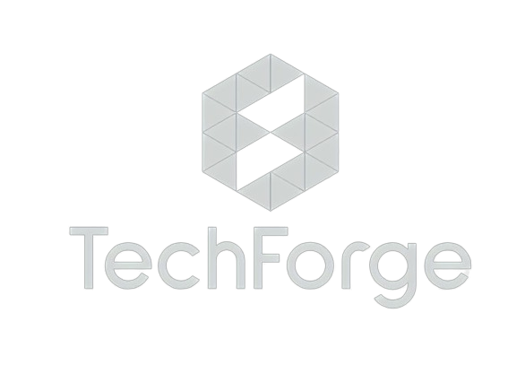

<h1 align="center"> TechForge</h1>

<p align="center">
   
</p>

## Tabla de contenido:

- [Tabla de contenido:](#tabla-de-contenido)
- [Traductor Braille](#traductor-braille)
- [Características](#características)
- [Tecnologías Utilizadas](#tecnologías-utilizadas)
- [Instalación con Docker](#instalación-con-docker)
  - [Clonar el Repositorio](#clonar-el-repositorio)
  - [Ejecutar la Aplicación Frontend con Docker](#ejecutar-la-aplicación-frontend-con-docker)
  - [Ejecutar la Aplicación Backend con Docker](#ejecutar-la-aplicación-backend-con-docker)
- [Estructura del Proyecto](#estructura-del-proyecto)
  - [Frontend](#frontend)
  - [Backend](#backend)
- [Uso](#uso)
- [Autores](#autores)
- [Contribución](#contribución)

## Traductor Braille

El Braille Traductor es una herramienta diseñada para mejorar la accesibilidad y facilitar la comunicación para personas con discapacidad visual. Esta aplicación permite la traducción bidireccional entre el español y el sistema Braille y genera documentos PDF en Braille para impresión en espejo.

## Características

- **Traducción Bidireccional**: Convierte texto de español a Braille y de Braille a español.
- **Generación de PDF**: Crea documentos PDF en Braille, preparados para impresión en espejo.
- **Interfaz Accesible**: Diseñada para ser utilizada fácilmente por personas con limitaciones visuales.
- **Tecnología Avanzada**: Construida con FastAPI y React, ofreciendo alta eficiencia y rendimiento.

## Tecnologías Utilizadas

- React
- Python
- FastAPI

## Instalación con Docker

Para usar Braille Traductor, debes tener Docker instalado. Sigue estos pasos para configurar y ejecutar la aplicación:

**Instalar Docker**:
   - Visita [Docker Hub](https://docs.docker.com/get-docker/) y descarga la versión adecuada para tu sistema operativo.

### Clonar el Repositorio

```bash
git clone https://github.com/riofutabac/BrailleTraductor.git
```

### Ejecutar la Aplicación Frontend con Docker

1. Abrir Docker e iniciar sesión

2. En Terminal accede a la carpeta de la Aplicación:
   ```bash
   cd Version_3
   cd Codigo
   cd frontend
   cd my-app
   ```

3. Construye la imagen de Docker:
   ```bash
   docker build -t <tu-usuario>front/my-app .
   ```

4. Ejecuta la imagen de Docker:
   ```bash
   docker run -p 3000:3000 <tu-usuario>front/my-app
   ```

   El servicio Web estará disponible en `http://localhost:3000`.

### Ejecutar la Aplicación Backend con Docker

1. Abrir Docker e iniciar sesión

2. En una nueva terminal accede a la carpeta de la Aplicación:
   ```bash
   cd Version_3
   cd Codigo
   ```

3. Construye la imagen de Docker:
   ```bash
   docker build -t <tu-usuario>back .
   ```

4. Ejecuta la imagen de Docker:
   ```bash
   docker run -p 8000:8000 <tu-usuario>back
   ```

El servidor FastAPI estará disponible en `http://localhost:8000`.

## Estructura del Proyecto

### Frontend

La aplicación frontend está construida con React y se encuentra en la carpeta `frontend/my-app`. Los principales componentes son:

- `Traductor.js`: Contiene la lógica principal para la traducción de texto y la exportación a PDF.
- `Option.js`: Componente que muestra las opciones de traducción de texto o carga de archivo.
- `NavBar.js`: Barra de navegación con el logotipo y el botón de modo oscuro.
- `Footer.js`: Pie de página con información de derechos de autor.

### Backend

El backend está construido con FastAPI y se encuentra en la carpeta `backend`. Los principales archivos son:

- `main.py`: Punto de entrada principal de la aplicación FastAPI.
- `routes.py`: Define las rutas de la API para la traducción de texto y la generación de PDF.
- `services/translator.py`: Contiene las funciones para la traducción de texto a Braille y viceversa.
- `services/pdf_generator.py`: Contiene las funciones para generar imágenes a partir de texto Braille y convertirlas a PDF.

## Uso

Abre la aplicación en tu navegador y utiliza la interfaz para introducir texto en español o Braille. Selecciona la dirección de la traducción y el sistema mostrará el resultado en tiempo real.

## Autores

- [@Andrés Cantuña](https://github.com/cantx08)
- [@Santiago Bejarano](https://github.com/santiagobejarano)
- [@Isaac Friedman](https://github.com/IsaacFriedman)
- [@Alexis Lapo](https://github.com/riofutabac)
- [@Matías Mejía](https://github.com/mtmatias1282)

## Contribución

Si deseas contribuir a este proyecto, puedes seguir los siguientes pasos:

1. Haz un fork del repositorio.
2. Crea una nueva rama con un nombre descriptivo para tu característica o corrección de errores.
3. Realiza tus cambios y realiza commits descriptivos.
4. Envía una solicitud de extracción (pull request) al repositorio principal.